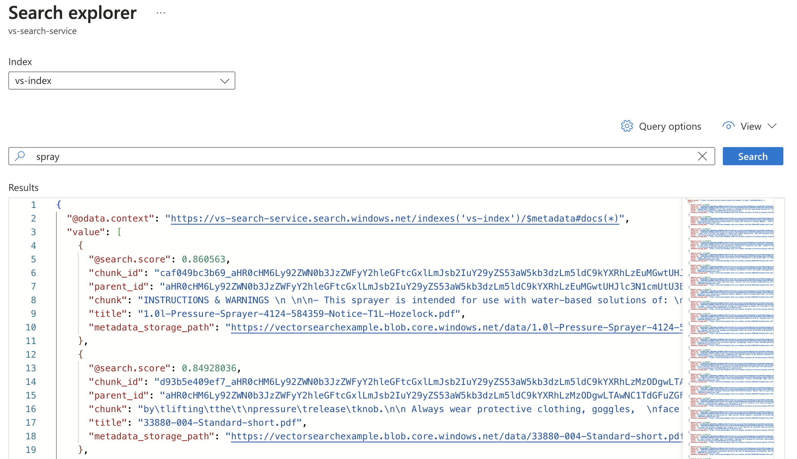

<link href="docs/style.css" rel="stylesheet"></link>

# Azure Vector Search Terraform Module

This Terraform module deploys a vector search capability on top of an existing blob storage container, using Azure's AI Search and OpenAI Service resources.

Default configuration is provided such that zero knowledge of vector search techniques or their implementation within Azure is required in order to deploy
and use the solution.

A minimal implementation of this module requires only a target resource group, storage account and container to be specified:

```tf
module "azure_vector_search_minimal" {
  source                 = "./modules/azure_vector_search/"
  resource_group_name    = "my-resource-group"
  storage_account_name   = "mystorageaccount"
  storage_container_name = "mystoragecontainer"
}
```

Applying this configuration will create and configure the following resources:

* An instance of the `text-embedding-ada-002` model, to generate the document & search query embeddings which make vector search possible
* An Azure OpenAI Service resource, which hosts this model and provides an interface to it
* An Azure AI Search resource, which - using the model deployed within Azure OpenAI - generates and stores embeddings for the documents contained within the target storage container, and which additionally provides a search interface which vectorizes user queries and returns matching chunks of text based on the embeddings.

Once the configuration has been applied, vector search will become available for the documents in your storage container:




## Installation

Clone this repo to your Terraform modules directory and run `terraform init`.

## Customization

### Resource Names

This module creates various new Azure resources, all of which are given default names specified in [variables.tf](variables.tf). Users of this module are free to specify different names by overriding default variable values in their module call.

### Vector Search Config

Most of the heavy lifting in this solution is done by various sub-resources of the Azure AI Search resource, which this module also manages. These are:

* A data source, which points to the data we want to be able to perform vector searches over
* An index, which is the searchable representation of this data
* An indexer, which produces this index
* A skillset, which defines how the indexer should produce the index (in our case - by chunking and generating embeddings for the documents located in our data source)

Users of this module who want to tune any of the above can copy the relevant config from [default_config.tf](default_config.tf) into their own module, make changes and then pass it back into this module via one of the provided module variables.

Example customization of data source config:

```tf
# root_module.tf

locals {
  # Copied from default_config.tf
  datasource_config = {
    name        = var.datasource_name
    description = null
    type        = "azureblob"
    subtype     = null
    credentials = {
      connectionString = data.azurerm_storage_account.main.primary_connection_string
    }
    container = {
      name  = var.storage_container_name
      query = null
    }
    dataChangeDetectionPolicy   = null
    dataDeletionDetectionPolicy = {
      "@odata.type": "#Microsoft.Azure.Search.NativeBlobSoftDeleteDeletionDetectionPolicy"  # Add native blob storage deletion detection
    }
    encryptionKey               = null
  }
}

module "azure_vector_search_custom" {
  source                 = "./modules/azure_vector_search/"
  resource_group_name    = "my-resource-group"
  storage_account_name   = "mystorageaccount"
  storage_container_name = "mystoragecontainer"
  datasource_config      = local.datasource_config  # Use custom data source config
}
```

## Acknowledgements

This solution leverages Mastercard's [REST API Terraform provider](https://registry.terraform.io/providers/Mastercard/restapi/latest) to provision the AI Search data source, index, indexer and skillset resources, since these are not yet natively supported by Azure's Terraform provider. Integrating these resources into Terraform using Mastercard's provider is an idea copied from [this Medium article](https://medium.com/expert-thinking/mastering-azure-search-with-terraform-a-how-to-guide-7edc3a6b1ee3), by Jake.